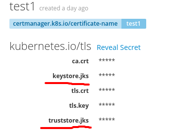
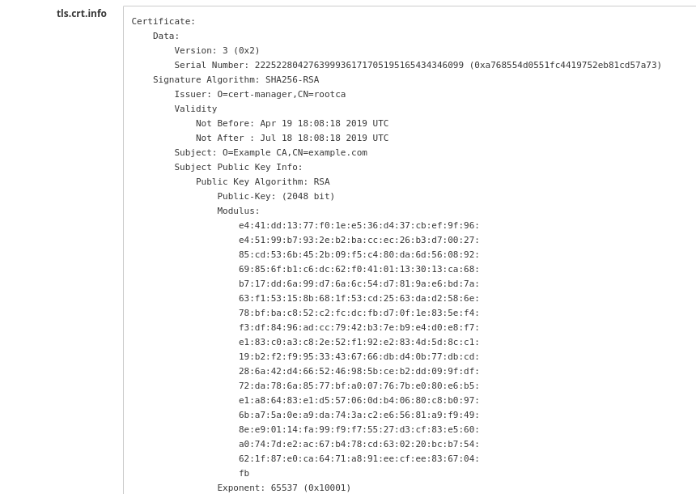

# Cert-utils-operator

[](https://travis-ci.org/redhat-cop/cert-utils-operator) [](https://quay.io/repository/redhat-cop/cert-utils-operator)

Cert utils operator is a set of functionalities around certificates packaged in a [Kubernetes operator](https://github.com/operator-framework/operator-sdk).

Certificates are assumed to be available in a [secret](https://kubernetes.io/docs/concepts/configuration/secret/) of type `kubernetes.io/tls` (other types of secrets are *ignored* by this operator).
By convention this type of secrets have three optional entries:

1. `tls.key`: the private key of the certificate.
2. `tls.crt`: the actual certificate.
3. `ca.crt`: the CA bundle that validates the certificate.

The functionalities are the following:

1. [Ability to populate route certificates](#Populating-route-certificates)
2. [Ability to create java keystore and truststore from the certificates](#Creating-java-keystore-and-truststore)
3. [Ability to show info regarding the certificates](#Showing-info-on-the-certificates)
4. [Ability to alert when a certificate is about to expire](#Alerting-when-a-certificate-is-about-to-expire)
5. [Ability to inject ca bundles in ValidatingWebhookConfiguration, MutatingWebhookConfiguration, CustomResourceDefinition object](#CA-injection)

All these feature are activated via opt-in annotations.

## Deploying the Operator

This is a cluster-level operator that you can deploy in any namespace, `cert-utils-operator` is recommended.
Here are the instructions to install the latest release

```shell
oc new-project cert-utils-operator
helm repo add cert-utils-operator https://redhat-cop.github.io/cert-utils-operator
helm repo update
export cert_utils_chart_version=$(helm search cert-utils-operator/cert-utils-operator | grep cert-utils-operator/cert-utils-operator | awk '{print $2}')
helm fetch cert-utils-operator/cert-utils-operator --version ${cert_utils_chart_version}
helm template cert-utils-operator-${cert_utils_chart_version}.tgz --namespace cert-utils-operator | oc apply -f - -n cert-utils-operator
rm cert-utils-operator-${cert_utils_chart_version}.tgz
```

## Populating route certificates

This feature works on [secure routes](https://docs.openshift.com/container-platform/3.11/architecture/networking/routes.html#secured-routes) with `edge` or `reencrypt` type of termination.

This feature is activated with the following annotation on a route: `cert-utils-operator.redhat-cop.io/certs-from-secret: "<secret-name>"`. Routes that are not secured (`tls.termination` field initialized to either `edge` or `reencrypt`) will be ignored even if they have the annotation.

The following fields of the route will be updated:

1. `key` with the content of `tls.key`.
2. `certificate` with the content of `tls.crt`.
3. `caCertificate` with the content of `ca.crt`.

The `destinationCACertificate` can also be injected. To activate this feature use the following annotation: `cert-utils-operator.redhat-cop.io/destinationCA-from-secret: "<secret-name>"`. The following field will be updated:

1. `destinationCACertificate` with the content of `ca.crt`.

Note that the two annotations can point to different secrets.

## Creating java keystore and truststore

This feature is activated with the following annotation on a `kubernetes.io/tls` secret: `cert-utils-operator.redhat-cop.io/generate-java-keystores: "true"`.

When this annotation is set two more entries are added to the secret:

1. `keystore.jks`: this Java keystore contains the `tls.crt` and `tls.key` certificate.
2. `trustsstore.jks`: this Java keystore contains the `ca.crt` certificate.

Note that Java Keystore require the key to be in [PKCS#8](https://en.wikipedia.org/wiki/PKCS_8) format. It is a responsibility of the certificate provisioner to make sure the key is in this format. No validation is currently performed by the cert-utils operator.

A such annotated secret looks like the following:



The default password for these keystores is `changeme`. The password can be changed by adding the following optional annotation: `cert-utils-operator.redhat-cop.io/java-keystore-password: <password>`. The alias of the certificate inside the keystore is `alias`.

## Showing info on the certificates

This feature is activated with the following annotation on a `kubernetes.io/tls` secret: `cert-utils-operator.redhat-cop.io/generate-cert-info: "true"`.

When this annotation is set two more entries are added to the secret:

1. `tls.crt.info`: this entries contains a textual representation of `tls.crt` the certificates in a similar notation to `openssl`.
2. `ca.crt.info`: this entries contains a textual representation of `ca.crt` the certificates in a similar notation to `openssl`.

A such annotated secret looks like the following:



## Alerting when a certificate is about to expire

This feature is activated with the following annotation on a `kubernetes.io/tls` secret: `cert-utils-operator.redhat-cop.io/generate-cert-expiry-alert: "true"`.

When this annotation is set the secret will generate a Kubernetes `Warning` Event if the certificate is about to expire.

This feature is useful when the certificates are not renewed by an automatic system.

The timing of this alerting mechanism can be controller with the following annotations:

| Annotation  | Default  | Description  |
|:-|:-:|---|
| `cert-utils-operator.redhat-cop.io/cert-expiry-check-frequency`  | 7 days  | with which frequency should the system check is a certificate is expiring  |
| `cert-utils-operator.redhat-cop.io/cert-soon-to-expire-check-frequency`  | 1 hour  | with which frequency should the system check is a certificate is expired, once it's close to expiring  |
| `cert-utils-operator.redhat-cop.io/cert-soon-to-expire-threshold`  | 90 days  | what is the interval of time below which we consider the certificate close to expiry  |

Here is an example of a certificate soon-to-expiry event:


## CA Injection

[ValidatingWebhookConfiguration](https://kubernetes.io/docs/reference/access-authn-authz/extensible-admission-controllers/), [MutatingWebhokConfiguration](https://kubernetes.io/docs/reference/access-authn-authz/extensible-admission-controllers/) and [CustomResourceDefinition](https://kubernetes.io/docs/concepts/extend-kubernetes/api-extension/custom-resources/) types of objects (and possibly in the future others) need the master API process to connect to trusted servers to perform their function. I order to do so over an encrypted connection a CA bundle needs to be configured. In these objects the cA bundle is passed as part of the CR and not as a secret, and that is fine because the CA bundles are public info. However it may be difficult at deploy time to know what the correct CA bundle should be. Often the CA bundle needs to be discovered as a piece on information owned by some other objects of the cluster.
This feature allows you to inject the ca bundle from either a `kubernetes.io/tls` secret or from the service_ca.crt file mounted in every pod. The latter is useful if you are protecting your webhook with a certificate generated with the [service service certificate secret](https://docs.openshift.com/container-platform/3.11/dev_guide/secrets.html#service-serving-certificate-secrets) feature.

This feature is activated by the following annotations:

1. `cert-utils-operator.redhat-cop.io/injectca-from-secret: <secret namespace>/<secret name>`

2. `cert-utils-operator.redhat-cop.io/injectca-from-service_ca: "true"`

## Local Development

Execute the following steps to develop the functionality locally. It is recommended that development be done using a cluster with `cluster-admin` permissions.

Ensure go modules are active by defining this environment variable:

```shell
export GO111MODULE=on
```

Using the [operator-sdk](https://github.com/operator-framework/operator-sdk), run the operator locally:

```shell
operator-sdk up local --namespace "" --operator-flags "--systemCaFilename $(pwd)/README.md"
```

replace `$(pwd)/README.md` with a PEM-formatted CA if testing the CA injection functionality.

## Release Process

To release execute the following:

```shell
git tag -a "<version>" -m "release <version>"
git push upstream <version>
```

use this version format: vM.m.z
